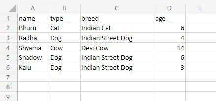
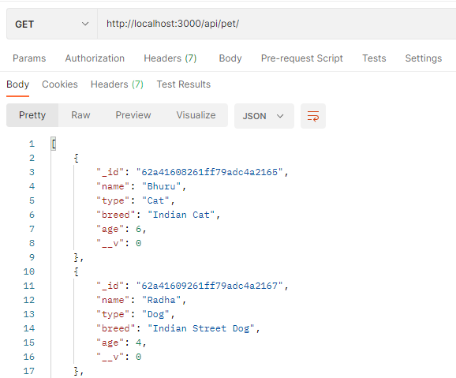

# Pet Shop API

This is a RESTful API that takes an excel file as input, parses it and stores the data in the database.
It uses NodeJs, Express and MongoDB.

# Features
-   A POST route “/api/pet” to add pets from an excel file to the Database
-   A GET route “/api/pet” to get all the pets in the Database
-   A GET route “/api/pet/**petId**” to get a specific pet
-   A PATCH route “/api/pet/**petId**” to update the details of a specific pet
-   A DELETE route “/api/pet/**petId**” to delete a specific pet

## Tools Used
- Uses the Node package  [SheetJS](https://www.npmjs.com/package/xlsx) from [npm](https://www.npmjs.com/) to  extract pet data from the spreadsheet named "data.xlsx" in the local directory.

## Working
- The Excel file has colums **Name**, **Type**, **Breed** and **Age**.\

- Node Package [SheetJS](https://www.npmjs.com/package/xlsx) takes the excel file and parses it, and adds it to the Database upon sending a POST Request to `http://localhost:3000/api/pet`.
- Upon sending a GET request to `http://localhost:3000/api/pet`, we get a JSON response containing all the pets in the Database.\

## Setting up on localhost

- Install and set up [NodeJS](https://www.youtube.com/watch?v=JINE4D0Syqw&ab_channel=Telusko).
- Set up [MongoDB](https://www.youtube.com/watch?v=wcx3f0eUiAw&ab_channel=WebDevSimplified).
- Type `git clone https://github.com/areyaar/Pet-Shop-API.git` on your git bash terminal and then `code .` to open the project on your favorite code editor.
- Type `npm install` in the terminal to install all the node packages and dependencies.
- Type `node app.js` to have the API running on the port **3000** of your localhost.

